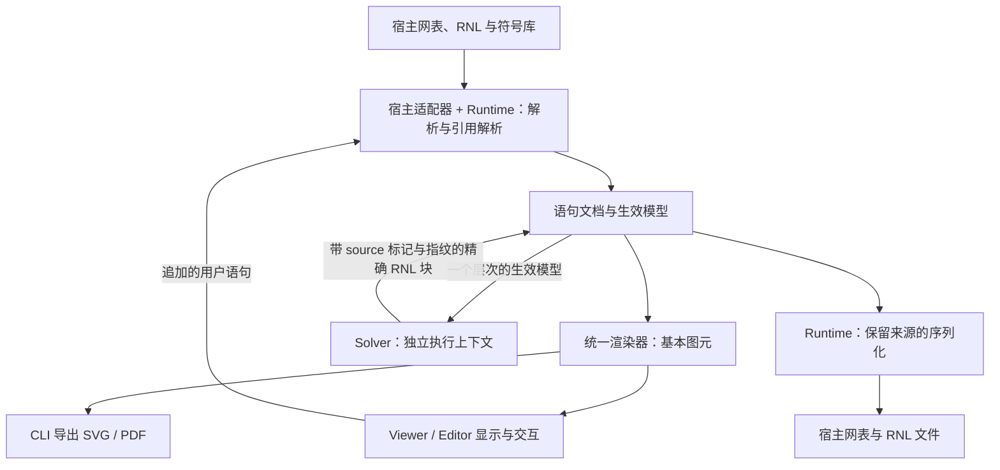

# RNL 独立工具链架构与技术栈方案

状态：架构提案，记录需求与推荐方案；尚未实施，不是已冻结的语言规范或性能承诺。

日期：2026-09-23。修订：2026-09-23，吸收首轮审阅讨论的结论，主要涉及 solver 输出契约与所有权（第 3.3、5 章）、runtime 形态与运行模式（第 4、6 章）、宿主适配器（第 4.1 节）、统一渲染器（第 4.3 节）、solver 确定性与依赖政策（第 4.2 节）、字体（第 7 章）和落地顺序（第 11 章）。修订：2026-09-24，迁入独立仓库后记录已决定的 npm 作用域（第 9.1 节）和许可证（第 12 章）。

来源：迁自 Analog Canvas 仓库（`cascode-ai/analog-canvas`）`rich-netlist` 分支的 `docs/standards/rnl-toolchain-architecture.md`，提交 `168ce69afc988b4e6a57816664fabdafb5d948ee`（2026-09-23），于 2026-09-24 迁入。迁入时除增加本段外，只修改了与文档位置有关的表述：删去"暂存于 Analog Canvas、待明确归属"的说明，更新两份语言草案的链接，并把第 8 章、第 12 章中指代 Analog Canvas 的"本仓库"改为明确名称；方案内容未改动。此后以本仓库为唯一维护位置。

许可：本文由版权所有者按 [CC-BY-4.0](../LICENSES/CC-BY-4.0.txt) 发布，仓库各部分的许可见[许可说明](../README.md#license)。Analog Canvas 中的冻结副本仍按该仓库的 AGPL-3.0 条款提供。

本文规划独立的 Rich Netlist（RNL）runtime、solver、viewer/editor，以及它们的模块、仓库和发行方式。目标工具链不依赖 Analog Canvas 的代码、运行环境或元件资产。

语言背景见 [RNL 原则草案](../spec/rich-netlist.md)和[语法讨论稿](../spec/RNL-Syntax-0.1-draft.2.md)。本文中的接口名、目录名、包名和能力约定均为设计示意，不意味着已有对应实现，也不新增已获确认的 RNL 语法。

## 1. 用户需求与方案状态

### 1.1 用户需求

以下需求整理自用户在本次讨论中的逐步澄清，是方案的输入。后续 Rust、TypeScript、Tauri 和 monorepo 等推荐不属于用户已经限定的实现方式。

1. **独立、轻量的 RNL 阅读工具。** 为 Rich Netlist 单独提供好用的 viewer，具备发展为编辑器的空间。
2. **快速启动指框架和界面。** 关注软件框架启动、窗口和界面加载到可交互的速度，不将求解时间计入这一要求。求解可以先给用户一个初始版本，再动态刷新更优结果。
3. **跨平台从一开始就是重点。** 希望获得类似 PDF 的使用体验：在绝大多数平台上都有好用的 viewer。不同平台的应用架构可以不同，但求解、渲染等核心能力希望以统一且可移植的模块提供。
4. **关键计算模块强调执行效率。** 尤其是 solver，倾向使用 Rust 或 C++ 等高效编译语言，同时兼顾移植性和升级后各平台的统一构建与发行。
5. **完全不依赖 Analog Canvas。** 不依赖其前端、运行环境或现有元件资源。现有 Canvas 仅可作为电路信息、层次、连接和交互概念的参考。
6. **viewer 不携带领域资产。** RNL 将具备内嵌 symbol 定义能力，标准 symbol 通过 RNL 库发布；viewer 提供通用的解析和显示能力，不以自身内置的元件库为前提。
7. **solver 与 renderer/editor 是两个核心。** 两者可以采用不同语言和运行平台。solver 使用编译语言，前端可以使用启动足够快的 JS 方案，也可以用 Rust 实现原生应用。
8. **两核之间保留完整的文档语义。** 传递的信息包含电路与层次、元件及 symbol 定义、走线、连接关系等，使前端能继续编辑，不能只传递失去电路对象身份的绘图数据。
9. **进一步使用 RNL 自身作为契约。** 因为 RNL 可以精确定义图形，solver 可以将高层语义转译为精确 RNL 描述，并保留原语义，利用语言支持的后续描述覆盖机制表达结果。无需另造一套独立的电路交换格式。
10. **viewer 可直接阅读精确 RNL。** 已有完整精确描述时直接渲染；遇到尚不精确的 RNL，再视情况调用 solver。调用 solver 不是每次打开文档的必经步骤。
11. **运行时不要求交换文本。** solver 和 viewer 实际通信可以采用高效的数据结构或其他通道，只要表达同一份 RNL 语义。
12. **适应早期标准的快速演进。** 语言在初期会频繁调整，技术栈和框架需要便于快速迭代与分发，优先考虑类似 npm 的安装、升级和模块消费机制。

本文件同时回答技术栈如何组合，以及 runtime、solver、viewer/editor 应采用一个还是多个 Git 仓库管理的问题。仓库与发布策略属于下文给出的推荐方案。

### 1.2 本方案推荐，仍需实现验证的选择

| 事项 | 推荐选择 | 尚需验证或确认 |
| --- | --- | --- |
| 核心语言 | Rust；solver 的全部依赖必须可用纯 Rust 实现并编译到 WASM | 精确坐标子求解器的选型与性能 |
| 宿主方言 | 首版同时支持 SPICE 与 Spectre 的结构子集 | 子集的精确范围、注释载体与保真写回验证 |
| runtime 形态 | 支持库，进程内链接进 viewer、CLI 和 solver | WASM 解析大文件的耗时 |
| 首个前端 | TypeScript viewer/editor；统一渲染器在 Rust 核心；SVG 输出 | 真实复杂图、高 DPI 和大层次交互表现 |
| 应用 UI | React + Vite，核心不依赖 React | 实际加载体积和首屏表现 |
| 桌面外壳 | Tauri 2 | 各平台冷启动、WebView 和文件集成 |
| 源码管理 | 新建独立 monorepo | 独立仓库名称和迁移安排 |
| SDK 发行 | npm + WASM，配套 Rust crate/native 产物 | 包名、公开 API、发布平台矩阵 |
| 版本策略 | 早期协调发布核心 SDK，符号库独立版本化 | 兼容窗口、破坏性变更与迁移策略 |

原生 Rust 前端是可选后续路线，不要求初期维护两套前端。Skia、tiny-skia、Qt、egui 等不作为本方案的必选依赖；若 Web 前端不满足实测目标，再围绕具体差距选型。

## 2. 总体架构：RNL 到精确 RNL

solver 的职责是解释呈现意图，输出一个层次的完整精确层：该层次全部对象的位置、姿态、走线坐标与风格和标签。viewer 的职责是解释可直接呈现的描述、生成基本图元并提供交互，不做布局决策。两者之间的正式语义契约仍然是 RNL。



这允许三种独立使用方式：

- 无 solver 的 viewer 打开已有完整精确描述的文件。
- CLI 或后台任务将语义 RNL 求解为精确 RNL，交给任意兼容 viewer。
- editor 与 solver 联动，用户编辑与后台优化共享版本化文档状态。

## 3. RNL 作为数据契约

### 3.1 电气事实与显示描述

宿主网表继续定义器件、参数、端子顺序、子电路接口和电气连接。RNL 引用、解释和呈现这些事实。solver 的布局输出不能增加或修改电气事实；线条接触、交叉或端点重合不能建立新的电气连接。

内存模型应保留宿主电路的只读投影及引用。viewer 可以据此搜索器件、追踪网络和进入层次；不应为了显示而维护另一套相互竞争的电气权威。

未来 editor 若支持改网表，需要显式的宿主编辑与写回操作。修改 RNL 呈现描述不隐式修改电气结构。

### 3.2 可直接渲染的能力约定

建议定义同一语言中的可直接渲染能力约定，暂称 `render-ready profile`，不是另一种文件格式。具体内容尚待规范化，候选条件包括：

- 当前显示范围使用的 symbol 和必要资源能够解析。
- 必要的对象位置、姿态和尺寸已经确定。
- 需要显示的路径、标签和标注具有足够的几何信息。
- 层次、引用与作用域足以确定生效描述。
- 必要的几何决策不再依赖约束求解。

判定可以按当前 cell 或显示范围进行，不要求展开整棵实例树。文件中保留高层语义不影响直接呈现；是否调用 solver 取决于几何是否缺失、是否失效或用户是否请求优化。

部分精确的文件，例如只有坐标没有走线，不由 viewer 自行补布局：已确定的部分照常显示，缺失的走线以飞线或缺线状态标出，并给出"需要求解"的状态。走线风格值的展开，例如只给锚点的直角连线如何生成拐点，是 runtime 中的纯函数规则，solver、CLI 和 editor 共用同一实现，避免重新求解后走线跳动。

没有 solver 时，viewer 对不能直接呈现的部分提供明确状态和可用的文档信息，不能假装完成求解。

"精确"指必要几何已确定，不承诺不同平台像素一致；字体由 viewer 环境决定，见第 7 章。

### 3.3 solver 输出、覆盖与标记

以下模型由审阅讨论确定：

- **solver 输出所求解层次的完整精确层。** 它重写该层次全部对象的坐标、姿态和走线，包括用户已经指定的坐标。用户语句是 solver 的第一优先级约束，因此重写的值与用户值一致。solver 块永远不是下一次求解的约束，只有无标记的用户语句是约束。
- **solver 块带来源标记与输入指纹。** 示意写法为 `@RNL(source="solver", input="…")`，字段名与取值待语法稿确认。标记和指纹不改变解析与生效规则，只是元数据；如何处理由工具决定，标准只给建议。语法上需要把它们列为"已识别但不影响解释"的入口字段，否则按语法稿 3.4 节的严格规则，旧解析器会拒绝整条记录。
- **用户后续修改追加在 solver 块之后**，按同层后写覆盖生效。标准不建议直接手工修改 solver 块；工具可以提供"另存原始档"，即丢弃带 source 标记的记录。
- **覆盖诊断只针对值不同的覆盖。** solver 重写用户坐标是同值覆盖，不提示；否则每个求解过的文件都会告警。求解之后出现值不同的覆盖，才是"求解后语义已修改"的直接证据。
- **指纹对 solver 的输入计算：** 该层次规范化后的语义语句（排除 solver 块自身）、所用库的版本和求解选项。空白、注释和换行的变化不影响指纹。viewer 据指纹不匹配提示"求解后语义已修改，建议重新求解"，这是状态提示，不是错误；旧结果仍照常显示。
- **下一次求解重新输出整个层次**，并可以清理此前已被用户语句覆盖的自身语句，避免多次求解后文件膨胀。清理是可选优化，不改变生效结果。

高层语义和精确描述可以同时存在。后写描述是否覆盖前写描述，仍遵循对应操作、对象和作用域的语言规则，不能泛化为所有描述一律最后一条获胜。

例如概念上：

```text
原始描述：M1、M2 构成差分对，并关于某轴对称。
求解补充：带 source 标记的块，给出 M1/M2 及本层次其余对象的位置、姿态和全部走线。
```

新的坐标覆盖同一属性的旧坐标；对称语义仍然保留，是下一次求解的输入。这段示例不是正式 RNL 语法。

### 3.4 四层表示

| 表示层 | 保留的信息 | 用途 |
| --- | --- | --- |
| 源文本与语法表示 | 文件来源、范围、普通注释、未知记录、编码和换行信息 | 诊断、精确编辑和保留式写回 |
| 语句文档 | 按作用域有序的 RNL 语句、source 标记、指纹、来源关系 | 编辑、追加、写回、指纹计算、可选清理 |
| 生效模型 | 按实例路径应用覆盖与继承后的宿主电路投影、层次、symbol、对象槽位（有值或 free）、语义约束 | solver 的输入、统一渲染器的输入 |
| 基本图元与缓存 | 线条、填充、文字等图元及其对象身份、包围盒、空间索引、可选 GPU 数据 | viewer 显示与命中、CLI 导出 |

语句文档与生效模型都是 runtime 的内存表示，后者由前者推导。solver 消费生效模型，输出的精确 RNL 块由 runtime 插回语句文档。文档模型是 RNL 的实现表示，不建立第二套独立电路语言。

对于支持的内容，直接接收内存更新，与将更新写成 RNL 后重新读取，应得到等价文档语义。内部 ID、缓存和会话修订号不必成为文件格式的一部分，但不能丢失影响语义的对象身份或来源。

## 4. 模块职责与依赖

### 4.1 Runtime 与宿主适配器

runtime 是支持库，不是独立进程或服务：viewer 以 WASM 形式在进程内链接它，CLI 和 solver 链接原生版本。同一 runtime 版本按文件声明的语言版本分派解释，而不是在一个应用里并载多个 runtime 构建；应用固定一个 runtime 发布版本。

runtime 实现 RNL 词法与语法解析、作用域和引用解析、覆盖规则、symbol 定义解释、走线风格展开等纯函数规则、诊断、文档事务及序列化。解析和求解属于独立模块；语法调整不应直接侵入搜索算法。

宿主适配器是独立的一层，每种方言一个包。它负责识别合法注释与安全位置、解析器件、端子、网、子电路接口和层次、按宿主的 include 展开顺序提供记录，并负责该方言的保真写回。适配器向 runtime 核心提供统一的宿主电路模型接口，核心不依赖任何具体方言。元件端子名和端子顺序是宿主语言知识，由适配器提供；语法稿明确端子名不能靠器件类型惯例猜测。

首版同时支持 SPICE 与 Spectre 两种方言的结构子集：实例、网、子电路定义与接口、include、模型身份；不做表达式求值，不解释仿真控制语句。两种方言同时进入首版，是为了让宿主电路模型接口从一开始就方言中立，并建立跨方言等价测试：同一电路分别写成两种方言，附同一份 RNL，生效模型必须相同。

宿主通过接口提供文件、include 和资源内容，runtime 不直接绑定桌面路径、网络下载、DOM 或窗口系统。TypeScript 前端通过 runtime 获得语句文档与生效模型，不维护另一套覆盖、作用域和引用解析规则。

### 4.2 Solver

solver 接收一个层次的生效模型、求解选项、目标优先级配置和用户约束，维护搜索状态，输出该层次的完整精确层。它不输出 DOM、SVG 元素、三角形或像素，也不引用 viewer 内部类型。

作用域是实例路径，顶层为空路径；一次任务只求解一个层次，求解时该层次生效的全部 RNL 约束都参与，包括顶层通过路径指定到该层次的语句。求解范围可以配置为整个文件逐层求解、只求顶层或任一子电路。结果默认写入该子电路的作用域；当同一子电路的某个实例因路径指定的语句而与定义本身不同，该实例的差异解写到顶层并指定 scope。这种用法预期罕见。子电路被单独取出到其他环境的问题由导出工具处理，RNL 文件不应被直接拆开使用。

确定性是设计要求：整数网格坐标；搜索预算以工作量计，例如候选数或布线次数，时间只作安全上限；同一 solver 版本的 native 与 WASM 构建在相同输入与相同工作量预算下输出逐字节相同。目标优先级配置是求解输入的一部分，应可持久化在文档中或记入指纹，否则"同一文件同一结果"不成立。

依赖政策：WASM 目标不能直接链接 C++ 库，SMT 求解器的 WASM 版本体积和初始化时间也不适合作为 viewer 侧可选组件，所以精确坐标子求解器必须能用纯 Rust 实现，例如差分约束、最小费用流或小规模整数规划。结构优先的离散枚举加逐候选精确求解与这个政策一致。

输出保留稳定对象引用、层次、必要的网络关联和生成来源。symbol 定义、端子位置和姿态变换由文档提供，不能依赖硬编码器件资源。

### 4.3 统一渲染器、viewer 与 editor

渲染分两段。第一段是统一渲染器，位于共享的 Rust 核心：展开 symbol 实例与变换，把 RNL 的图形描述翻译成线条、填充、文字等基本图元，每个图元带对象身份和包围盒。第二段由各工具完成最终输出：viewer 画成 SVG，CLI 导出 SVG 或 PDF，golden 测试比较图元列表或输出文件。这样三处输出一致，命中测试直接使用图元包围盒，未来的 Rust 原生前端除最终绘制与 UI 外全部复用。

viewer 实现缩放、平移、选择、命中、搜索、网络高亮和层次导航。runtime 与渲染器在同一进程同一线程内，这些查询都是同步调用，不跨 Worker 或 IPC。viewer 不做布局决策。

editor 在 viewer 之上提供编辑工具、事务和撤销重做，通过 runtime 验证并应用文档变化。用户的手工调整追加为普通用户语句；拖动器件时由 editor 内嵌的轻量 router 重画相关走线，不要求 solver 在线。editor 自动生成的重布线可以带自己的 source 标记，以便下一次求解替换它们，只有用户的显式摆放是无标记的约束；是否采用这种区分由 editor 决定，语言层不区分"临时摆放"和"锁定"。

首版的编辑基础围绕呈现和约束。完整宿主网表编辑属于额外能力，需要独立确定支持边界。

### 4.4 依赖方向

```text
宿主适配器 → runtime 核心接口
solver     → runtime
渲染器     → runtime（同属共享核心）
viewer     → runtime + 渲染器，进程内链接
editor     → viewer + runtime 的编辑接口 + 轻量 router
应用       → 所需模块 + solver 传输适配器
```

runtime 不依赖 solver、viewer 或标准符号库；viewer 不强制依赖 solver。两者的连接由应用或独立适配器完成，安装 viewer 不应自动引入整个求解依赖。

### 4.5 支持语言快速演进的机制

需求 12 由以下机制支撑，分发方式只解决"怎么发出去"。这些机制本轮记录，尚待实现验证：

1. 操作签名目录是数据文件，包含语法稿 9.1 节要求每个操作声明的全部信息；解析校验、文档表格、TS 类型和一致性测试骨架从它生成。新增或修改一个操作是改一个数据文件加一个语义处理器。
2. 生效模型的 schema 只在 Rust 定义一次，TS 类型生成，不手写镜像。
3. 一致性语料是"宿主文件加期望生效模型"的目录，带语言版本标签；native 和 WASM 两个 runtime 跑同一份。
4. 提供迁移工具，把语料和样例从一个草案版本升到下一个，破坏性改动不让样例作废。
5. solver 与 viewer 只依赖生效模型类型，不依赖语法层类型；不改变生效模型的语法改动对它们不可见。

## 5. 增量求解与并发编辑

### 5.1 求解协议

solver 的公开契约是一套消息协议，而不是进程内函数：开始时携带一个层次的生效模型快照、选项、优先级配置和输入指纹；随后是进度更新、完成或取消；终止状态区分取消、超时、无可行结果和已证明无解。同一协议用于 Web 的 Worker、桌面的 Tauri channel 与后台线程、CLI 的标准输入输出，以及未来可能的远程求解服务。

```text
start(level_snapshot, options, fingerprint)
update*  → 该层次的完整精确层块
done | cancelled | timeout | infeasible
cancel()
```

按工作量切片推进是 solver 内部的原语，用于单线程回退；一次推进不重新创建整个求解问题。单线程是完整功能基线，多线程和 SIMD 是可选加速，不应成为读取精确 RNL 的前提。

每次更新都是该层次精确层块的完整快照，以对象身份为键，幂等；不发送相对上一次更新的增量。UI 可在初始结果出现后显示它，再接收更优结果；更新节奏与求解迭代频率解耦，优先消费最新结果，避免积压。

### 5.2 更新信封

| 类型 | 内容 |
| --- | --- |
| 文档快照 | 文档身份、修订号、目标层次路径、该层次的生效模型、symbol 与库版本 |
| 求解更新 | 任务身份、输入指纹、更新序号、目标层次路径、完整精确层块、状态 |
| 编辑事务 | 基础修订号、追加或修改的语句、来源和事务身份 |

初期采用结构化消息。出现明确传输瓶颈后再增加二进制编码或可转移缓冲区。JSON 只是可能的传输编码，不是第二种正式文档格式。

### 5.3 失效与所有权

三类信息在文件中的表达：用户明确约束是无标记的用户语句；solver 当前结果是带 source 标记的块；用户要固化某个值，就把它以用户语句追加在后面，下一次求解视为硬约束。不通过去掉 source 标记来"接受"结果。

旧任务的更新不能覆盖新编辑：更新携带输入指纹，runtime 拒绝指纹与当前文档不符的更新，并取消或重启任务。缩放、选择和当前层次状态不属于求解输出，应在更新中保持。

用户在 solver 块之后追加语句后，viewer 按指纹提示语义已修改；下一次求解重新输出整个层次，并可选清理被覆盖的自身语句，见 3.3 节。

### 5.4 持久化与再次打开

后写覆盖只决定生效值；生成结果是否仍适合当前输入由指纹判断，指纹随 solver 块一起持久化，跨工具有效。旧结果允许显示并标记过期，但永远不是下一次求解的硬约束。

只改 RNL 时，应保留宿主正文和普通注释；未知内容的读取、诊断与保存遵循支持的语言版本策略。不能只依据求解后的显示投影重建原文件。

## 6. 技术栈与运行模式

### 6.1 推荐组合

| 模块 | 推荐实现 | 选择理由 |
| --- | --- | --- |
| runtime / 宿主适配器 / 统一渲染器 | Rust，独立 crates，共享核心 | 原生执行、WASM 编译、CLI 与 viewer 输出一致 |
| solver | Rust，纯 Rust 依赖 | 原生与 WASM 双路径、确定性 |
| Web 绑定 | wasm-bindgen，配合 wasm-pack 等构建工具 | 生成 JS 接口并包装为 npm 包 |
| viewer / editor | TypeScript，核心不依赖 React | 快速迭代、浏览器嵌入和 npm 分发 |
| 最终输出 | SVG 起步 | 矢量、文字、交互与早期调试方便；图元列表不绑定 SVG，后端可换 |
| 应用界面 | React + Vite | 常规 UI 与构建工具，隔离于 RNL 核心 |
| 桌面外壳 | Tauri 2 | 复用 Web 前端并接入原生求解与文件能力 |
| CLI | Rust | 无 UI 的检查、求解、渲染和序列化 |
| 符号库 | RNL 数据包 | 与引擎和应用独立演进 |

Rust 与 C++ 都能实现高效求解，没有语言本身保证更快的结论。优先优化算法、数据布局、增量计算、分配和热点。依赖政策见 4.2 节：不能把宿主语言可移植等同于全部依赖可移植。

### 6.2 Web

```text
React 界面 + TypeScript viewer/editor
        ↕ 同步调用，进程内
主线程中的 WASM runtime + 统一渲染器
        ↕ 求解消息协议：快照 / 完整更新
Worker 中的 WASM solver，含自己的 runtime 实例，按需加载
```

runtime 与渲染器在主线程，命中、搜索和高亮都是同步调用；超大文件的解析可以在验证后移到 Worker，以序列化的生效模型回传。solver 独立加载，界面加载不等待 solver 下载、初始化或求解。solver 的 WASM 若启用多线程，需要 SharedArrayBuffer，即部署必须发送跨源隔离头；静态部署要验证这一点。单线程 solver 没有这个要求。

### 6.3 桌面

```text
Tauri WebView：同一套 TypeScript viewer/editor + 同一 WASM runtime 与渲染器
        ↕ 求解消息协议：Tauri channel
Rust 后台线程中的原生 solver；文件读写、文件关联、拖入、更新由 Tauri 提供
```

桌面与 Web 的前端代码路径完全相同，Tauri 只接入两个缝：文件 I/O 和 solver 传输。原生 solver 满足需求 4 的执行效率。若 WebView 侧的 WASM 启用多线程，自定义协议同样需要跨源隔离头。

Tauri 使用系统 WebView；安装包较小不能证明冷启动足够快，也不能证明所有 Linux 发行版都能开箱即用。需要在目标系统上验证依赖和行为。

### 6.4 移动端与未来原生前端

从项目早期验证移动浏览器上的精确 RNL 阅读，并保持 runtime/solver 的移动编译能力。正式原生移动应用可采用经过验证的共享外壳，也可以通过 C ABI 等接口接入 Swift/Kotlin。

若桌面实测不满足启动或交互目标，可另做 Rust 原生前端。它复用 runtime、solver、统一渲染器、命中逻辑、RNL 库和一致性语料；只有 TypeScript 的最终绘制与 UI 代码需要重写，必须计入第二套前端的实现成本。

跨平台首先保证语义一致和能力可声明，不承诺所有平台具有相同 UI、相同执行速度或逐像素一致的画面。

## 7. Symbol、字体与文档资源

viewer 理解通用路径、变换、端子、文字等能力，但不携带器件目录和内置元件图形。标准 symbol 通过普通 RNL 库定义和发布。

资源解析由宿主提供，建议支持本地文档依赖、明确版本的库和可离线携带的依赖集合。版本或内容哈希用于防止同一文件随"最新版"库变化而产生不同图形。

接近 PDF 的分享体验需要接收方能取得全部必要资源。可以设计可打包依赖的文档分发形式，但容器格式、清单和相对路径规则尚未确定；不因出现类型名称而自动联网。

字体由 viewer 环境提供并可配置。标签在 viewer 中可以改字体、改大小或隐藏，solver 不依赖实际文字度量，标签压线不是正确性问题。本方案不建立字体嵌入、缺失回退或 solver 与 viewer 共用的度量契约，也不承诺跨平台文字外观一致。

## 8. 源码组织：一个独立 monorepo

推荐新建独立于 Analog Canvas 的仓库，把 runtime、solver、viewer/editor、标准库与规范放在同一个 monorepo 中。三个主要交付物是模块边界，不要求对应三个 Git 仓库。建议建仓时把语言草案与一致性语料一并迁入，Analog Canvas 只保留指向新仓库的链接。

RNL 初期一次语言调整可能同时改变规范、解释器、求解输出、渲染和测试。单仓库允许同一提交或 PR 表达完整变化，并验证兼容组合。提前拆仓库会增加依赖发布、跨仓库协调和不兼容中间状态。

建议目录：

```text
rnl/
├─ spec/                       # 语言与能力约定，一致性语料的规范来源
├─ crates/
│  ├─ rnl-runtime/             # 语言核心：解析、作用域、覆盖、事务、序列化
│  ├─ rnl-host-spice/          # SPICE 结构子集适配器与保真写回
│  ├─ rnl-host-spectre/        # Spectre 结构子集适配器与保真写回
│  ├─ rnl-render/              # 统一渲染器：生效模型到基本图元
│  ├─ rnl-solver/              # 求解核心
│  └─ rnl-cli/                 # 检查、求解、渲染、迁移
├─ bindings/
│  └─ wasm/                    # WASM 绑定入口：runtime + 渲染器；solver 单独入口
├─ packages/
│  ├─ runtime/                 # npm 接口与生成类型
│  ├─ solver/                  # npm 求解接口与 Worker 封装
│  ├─ viewer/                  # 图元绘制与浏览
│  └─ editor/                  # 编辑工具、事务接口与轻量 router
├─ libraries/
│  └─ standard/                # 标准 RNL 符号库
├─ apps/
│  ├─ web/                     # 参考 Web 应用
│  └─ desktop/                 # Tauri 应用
├─ tests/
│  ├─ conformance/             # 语言一致性、跨方言等价
│  ├─ roundtrip/               # 读取、修改、写回
│  └─ integration/             # 求解到显示与编辑
└─ examples/
```

Rust 使用 Cargo workspace，TypeScript 使用 pnpm workspace。两套工具共存，各自管理依赖与构建，由根级脚本和 CI 协调；初期无需引入更重的统一构建系统。

单仓库不允许绕过模块边界直接引用内部实现。包仍应通过公开接口消费，并验证打包后的独立安装。未来出现独立团队、权限边界或稳定且低频的跨模块变化时，再考虑拆仓库；标准若形成独立治理，也可以单独管理规范与一致性测试。

## 9. 分发与版本策略

### 9.1 发行物

| 发行物 | 建议渠道 | 消费者 |
| --- | --- | --- |
| runtime / 渲染器 / solver Rust 库 | crates 与原生构建产物 | Rust 应用、原生宿主 |
| runtime / 渲染器 / solver WASM | npm 包及对应 JS 接口 | Web、JS 工具和嵌入应用 |
| viewer / editor | npm | Web 应用、桌面前端 |
| 标准符号库 | npm 数据包及普通归档 | 所有平台的资源解析器 |
| CLI | 各平台预编译程序 | 命令行用户与自动化 |
| 桌面应用 | 安装包及应用更新渠道 | 终端用户 |
| Web 应用 | 静态部署 | 浏览器用户 |

npm 包使用已注册的 `@rich-netlist` 组织作用域，见[决策 0003](decisions/0003-npm-scope.md)。包名暂以 `@rich-netlist/runtime`、`@rich-netlist/solver`、`@rich-netlist/viewer`、`@rich-netlist/editor`、`@rich-netlist/stdlib` 表达意图，具体名称仍待确认。

npm 解决模块分发，不自动更新已安装桌面应用。跨平台统一发布指同一源码版本、锁定依赖、测试矩阵和产物清单；不意味着所有平台使用同一二进制，也不保证应用商店审核同时完成。

### 9.2 版本分层

| 版本 | 意义 |
| --- | --- |
| RNL 语言版本 | 文档应如何解释 |
| SDK 文档接口 / 通信版本 | runtime、solver 和前端如何交换结构化数据 |
| 软件包版本 | 实现、算法、修复和 API 的发行版本 |
| 标准库版本 | symbol 和其他库定义的内容 |

接口版本不是另一套电路标准。语法变化若被 runtime 吸收且保留相同生效模型，前端和 solver 不必修改；新增前端必须理解的能力则需要显式兼容处理。

建议早期协调发布核心 SDK 包，提供已验证的兼容组合，标准符号库独立版本化。使用 `next` 发布预览迭代、`latest` 发布经过验证的版本；应用固定兼容组合，不在启动时各自追踪最新版。

JS 包版本与变更记录可使用 Changesets；Rust crates 可用 release-plz 或 cargo-release 协调版本。WASM、CLI 和应用由同一发布流水线协调；Changesets 本身不负责全部 Rust 发行。跨 registry 的发布不能假定原子完成，应先验证整组产物，再提升推荐版本，并能识别部分发布失败。

### 9.3 一次发行的基本流程

1. 选定源码提交，固定依赖与工具链，记录语言和接口支持范围。
2. 构建并测试原生目标和 WASM，生成类型、绑定与发行包。
3. 从打包产物验证独立安装及跨模块兼容，避免 workspace 链接掩盖缺失文件。
4. 先发布预览产物和兼容清单，通过后提升稳定渠道。
5. 发布 Web、CLI、桌面安装包及必要的签名产物。

目标平台矩阵、最低系统版本、CPU 架构和签名安排必须显式确定，不能以"支持跨平台"代替发行验收。

## 10. 验证与性能边界

### 10.1 启动与加载

分别测量进程冷启动到可交互、Web 首次/缓存加载、精确 RNL 打开到首帧、solver 初始化与首次结果、持续求解期间交互延迟、内存及发行体积。测量需要一组固定的参考文档，按规模分为小、中、大三档，例如十余个器件的单层电路、数百器件的多层次电路和数千器件的电路；没有参考语料就无法执行验收。

启动验收不包含求解耗时；应用也不能在实现上把 solver 初始化放进必须等待的首屏路径。性能目标数值待参考机器、图规模和平台范围确定后制定，当前没有已验证的毫秒数或体积承诺。

### 10.2 语义与互操作

- 同一文档在 native/WASM runtime 上的引用、覆盖和诊断符合相同契约。
- 同一电路的 SPICE 与 Spectre 版本附同一份 RNL，得到相同的生效模型。
- 文本通道与内存通道得到等价的有效文档语义。
- 含高层语义和完整几何的文档，在完全不加载 solver 时仍可阅读。
- 生成精确 RNL 后保存并再次打开，不需要重新求解才能显示，且指纹匹配。
- 只改空白、注释或换行不改变指纹；改动语义语句改变指纹。
- 覆盖诊断只在值不同时出现；solver 重写用户坐标不产生诊断。
- 修改呈现描述不改变宿主电气事实；保留式写回不重排宿主正文。
- 旧任务结果不能覆盖新编辑，撤销重做与文档修订一致。
- 同一 solver 版本的 native 与 WASM 构建在相同输入与工作量预算下输出逐字节相同；不同预算或版本允许不同可行布局，不能被误判为格式不兼容。

### 10.3 渲染与资源

验证 symbol 实例化、端子与姿态变换、层次选择、网络关联、资源缺失状态和高 DPI 行为。统一渲染器的图元列表是 CLI 与 viewer 共同的比较对象；跨平台采用适当的图像容差，并单独检查语义和几何，不能只靠截图判断连接正确。

### 10.4 健壮性

viewer 会打开任意来源的文件。宿主适配器与 RNL 解析器需要模糊测试，并限制 include 深度、层次深度和文件大小；资源加载只经宿主接口，默认不访问网络，不执行任何代码。

## 11. 落地顺序与验收问题

以下是未来实施顺序，不是当前已启动的工作清单。

1. **精确 RNL 阅读闭环。** 实现最小 runtime、两种宿主方言的结构子集适配器、统一渲染器、外部 symbol 库、CLI 的检查与渲染，以及 TS viewer；在不安装 solver 时打开同一组完整精确案例，跨方言等价测试通过。Tauri 冷启动、WASM 解析耗时、IPC 吞吐作为独立的测量项并行进行，不阻塞本阶段。
2. **求解闭环。** solver 输出带 source 标记与指纹的完整精确层，支持持续更新、保存、重新读取和过期检测；同一语义实现具备 native/WASM 路径且输出一致。
3. **编辑闭环。** 追加式用户编辑、轻量 router、撤销重做、修订检查、重新求解与可选清理，验证用户语句与 solver 块的归属。
4. **发行闭环。** 从 npm 独立安装，生成 CLI/桌面产物，验证离线资源携带和兼容版本组合。
5. **按证据扩展。** 根据实际性能决定 GPU 后端、二进制通道、多线程，以及是否需要原生 Rust 前端。

首个阶段已经需要验证跨平台和 solver 可选边界，而不是先依赖单一桌面环境完成全部功能后再移植。

## 12. 尚待决定的问题

- 两种宿主方言结构子集的精确范围、注释载体和保真写回的验证矩阵；RNL 语法版本和可直接渲染能力的精确范围。
- source 标记与指纹的入口字段语法、指纹规范化的精确定义，以及 solver 清理被覆盖自身语句的触发条件。
- editor 是否为临时摆放和自动重布线使用自己的 source 标记。
- symbol 定义语言、标准库加载、版本固定与离线容器形式。
- 精确坐标子求解器的纯 Rust 选型，以及目标优先级配置的持久化位置。
- 首版平台/架构矩阵及可衡量的启动和交互预算。
- crate 命名、兼容窗口与发布治理；npm 作用域已确定为 `@rich-netlist`，见[决策 0003](decisions/0003-npm-scope.md)。
- 本仓库的许可证已确定（代码 MIT、规范与文档 CC-BY-4.0、数据 CC0-1.0），见[决策 0002](decisions/0002-licenses.md)。移植 Analog Canvas 仓库中 AGPL 下的代码（例如 Python 求解原型）之前，仍需其版权所有者对该部分重新授权。

这些问题不影响总体模块划分，但必须在对应实现或语言能力冻结前作出明确决定。

## 13. 技术资料

以下链接用于核查工具能力，不构成性能保证；正式工程应固定依赖版本。

- [Cargo workspaces](https://doc.rust-lang.org/cargo/reference/workspaces.html)：Rust 多包管理。
- [pnpm workspace](https://pnpm.io/workspaces)：JS/TS 多包管理。
- [wasm-bindgen](https://github.com/wasm-bindgen/wasm-bindgen)：Rust 与 JS/WASM 绑定。
- [wasm-pack](https://github.com/drager/wasm-pack)：WASM 包构建与 npm 工作流。
- [Rust 平台支持](https://doc.rust-lang.org/rustc/platform-support.html)及 [WASM 目标限制](https://doc.rust-lang.org/rustc/platform-support/wasm32-unknown-unknown.html)：目标能力与支持层级。
- [SharedArrayBuffer 的安全要求](https://developer.mozilla.org/en-US/docs/Web/JavaScript/Reference/Global_Objects/SharedArrayBuffer)：多线程 WASM 所需的跨源隔离。
- [Tauri 架构](https://v2.tauri.app/concept/architecture/)及 [WebView 平台](https://v2.tauri.app/reference/webview-versions/)：桌面外壳及运行依赖。
- [Tauri 调用前端与 channel](https://v2.tauri.app/develop/calling-frontend/)：桌面侧 solver 传输。
- [Changesets](https://github.com/changesets/changesets)：多包版本和变更记录。
- [npm 发行标签](https://docs.npmjs.com/adding-dist-tags-to-packages/)：预览与稳定分发渠道。
